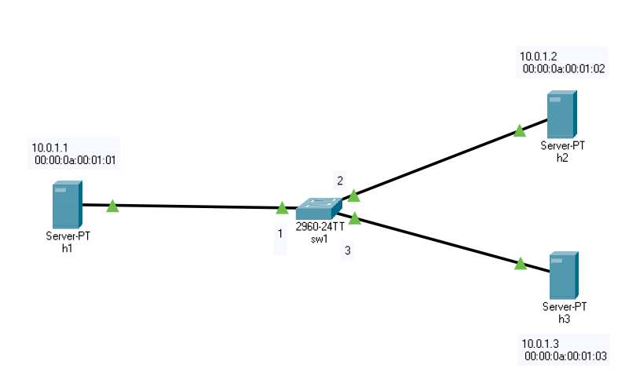

# SIMPLE TROTTLE

simple_throttle is a Verca project, that implements bandwidth throttle as a Intrusion Reaction to DDOS Attack using data plane programming. 

## Topology

We will use the following topology for this project: <br/> 
<br/>


## Usage
1. In your shell, run:
   ```bash
   sudo p4run
   ```
   This will:
   * compile `basic.p4`, and
   * start the pod-topo in Mininet and configure a switch with
   the appropriate P4 program + table entries, and
   * configure all hosts with the commands listed in
   [p4app.json](./p4app.json)

2. In other terminal run controller app to set drop rates dynamically
   ```bash
   sudo python controller1.py s1
   ```
3. You should now see a Mininet command prompt. Try to run some iperf
   TCP flows between the hosts. 
   ```bash
   mininet> iperf h1 h2
   ```
4. Type `exit` to leave the Mininet command line.
 
[DEMO](https://lthsfuldade-my.sharepoint.com/:v:/g/personal/imron_gamidli_lt_hs-fulda_de/EY65RSaoLilApGvkyJzPh_cBhnp3KyP629_AAV918oEubg?e=pp8FhE)
[DEMO 09.06.2021](https://lthsfuldade-my.sharepoint.com/:v:/g/personal/imron_gamidli_lt_hs-fulda_de/EZgtomApr5lKh2Ri5iETANsBLWFaup25VzQDayhBmgixeg?e=yJQ6HS)
